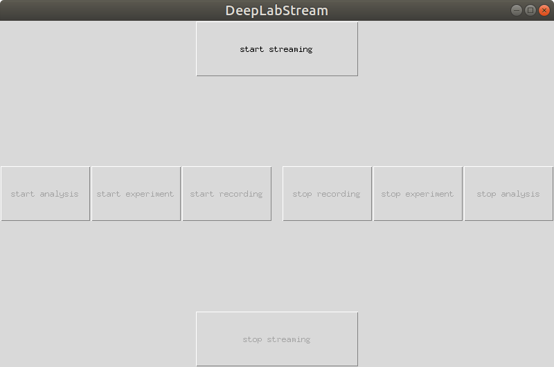
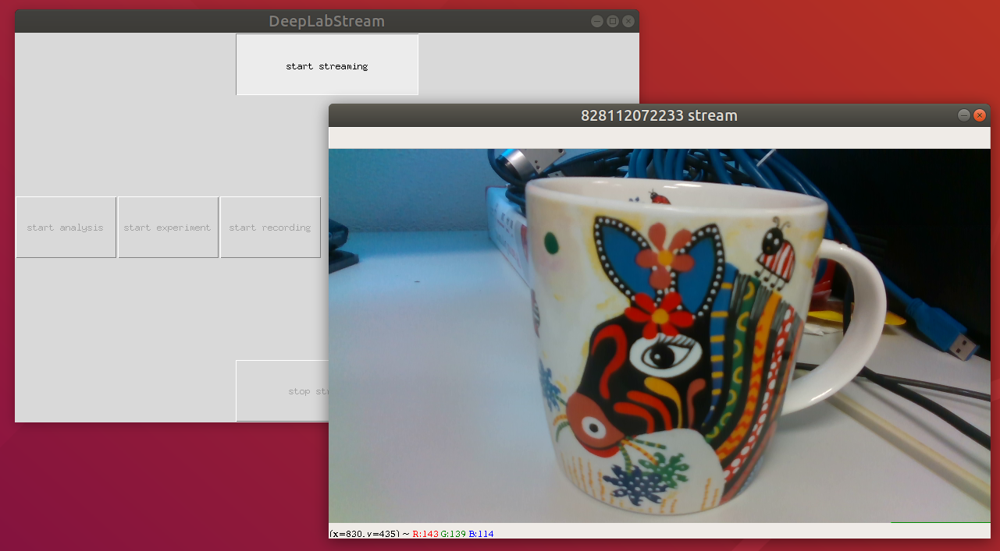
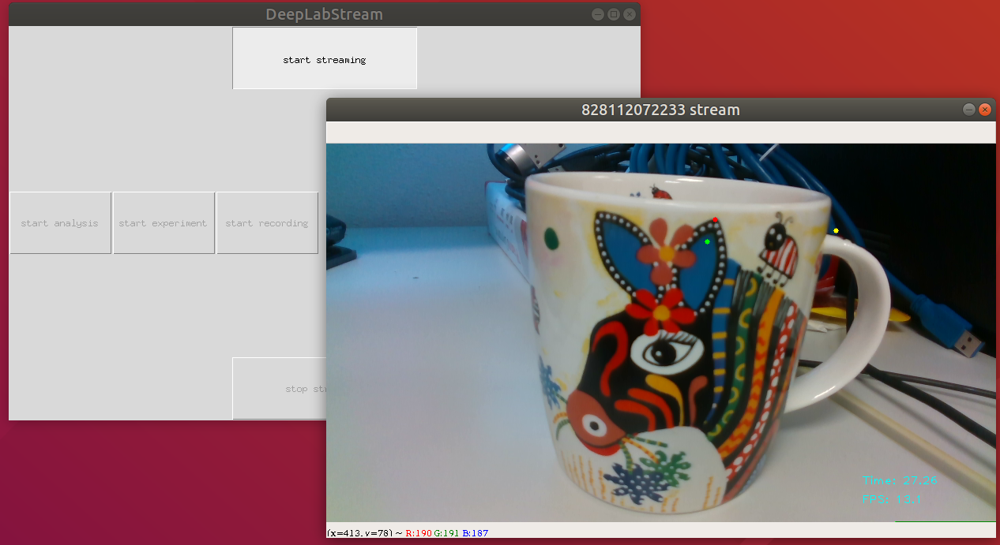

# DeepLabStream

DeepLabStream is a python based multi-purpose tool that enables the realtime tracking of animals and manipulation of experiments.
Our toolbox is adapted from the previously published [DeepLabCut](https://github.com/AlexEMG/DeepLabCut) ([Mathis et al., 2018](https://www.nature.com/articles/s41593-018-0209-y)] and expands on its core capabilities.
DeepLabStreams core feature is the real-time analysis using any type of camera-based video stream (incl. multiple streams).  Building onto that, we designed a full experimental closed-loop toolkit. It enables running experimental protocols that are dependent on a constant stream of bodypart positions and feedback activation of several input/output devices. It's capabilities range from simple region of interest (ROI) based triggers to headdirection or behavior dependent stimulation.

## Installation

### Hardware requirements

Your hardware, obviously, should be in compliance with DeepLabCut requirements to be able to run DeepLabStream. 
But DeepLabStream also requires more processing power than DeepLabCut to be easy and convenient to use.
We are really **not** recommending using this software without GPU, even though DeepLabCut supports this.

In general, you need:
- CUDA-compatible Nvidia videocard (Nvidia GTX 1080 or better is recommended);
- CPU with at least 4 cores to properly utilize parallelization;
- Decent amount of RAM, at least 16 Gb;

We tested DeepLabStream with multiple different setups and would say that minimum reasonable configuration would be:
```
CPU: Intel Core i7-7700K CPU @ 4.20GHz
RAM: 32GB DDR4
GPU: Nvidia GeForce GTX 1050 (3GB)
```

However, our recommended setup, with which we did achieve constant 30 FPS with 2 camera setup at 848x480 resolution:
```
CPU: Intel Core i7-9700K @ 3.60GHz
RAM: 64 GB DDR4
GPU: Nvidia GeForce RTX 2080 (12GB) 
```

### Preparations

In short, you need to be able to run DeepLabCut on your system before installing and running DeepLabStream.

[Here](https://github.com/AlexEMG/DeepLabCut/blob/master/docs/installation.md) is a full instruction by DeepLabCut,
but we will provide a short version/checklist below.

1. Make sure that you have the proper Nvidia drivers installed; 
2. Install [CUDA Toolkit](https://developer.nvidia.com/cuda-toolkit) by Nvidia. 
Please refer to this [table](https://stackoverflow.com/questions/30820513/what-is-the-correct-version-of-cuda-for-my-nvidia-driver/30820690#30820690) to ensure you have the correct driver/CUDA combination;
3. Verify your CUDA installation on [Windows](https://docs.nvidia.com/cuda/cuda-installation-guide-microsoft-windows/index.html#verify-installation)
or [Linux](https://docs.nvidia.com/cuda/cuda-installation-guide-linux/index.html#verify-installation);
4. Create an environment. We strongly recommend using [environments provided by DeepLabCut](https://github.com/AlexEMG/DeepLabCut/blob/master/conda-environments/README.md);
5. If you are not using DeepLabCut-provided enviroments for step 4, install [cuDNN](https://developer.nvidia.com/cudnn).
Otherwise, skip this step;
6. Install [Tensorflow](https://www.tensorflow.org/install/) using your environment from step 4. Short and ideal version would be simply running 
    ```bash
    pip install tensorflow-gpu==1.12
    ``` 
    But a lot of different problems could arise, depending on your software and hardware setup;
7. Verify that your TensorFlow is working correctly by using [this](https://askubuntu.com/questions/872098/how-to-check-if-i-installed-tensorflow-with-gpu-support-correctly/875992) (Linux)
or [this](https://towardsdatascience.com/installing-tensorflow-with-cuda-cudnn-and-gpu-support-on-windows-10-60693e46e781) (Windows) manual. 
The latter also provides a great overview of the whole process with the previous six steps.

DeepLabStream was originally designed with with [DeepLabCut v1.11](https://github.com/AlexEMG/DeepLabCut/blob/1.11/docs/installation.md) in mind, but for the ease of installation and future-proofing we recommend current [DeepLabCut 2.x](https://github.com/AlexEMG/DeepLabCut) ([Nath, Mathis et al, 2019](https://www.nature.com/articles/s41596-019-0176-0)) . Both versions and networks trained with them worked fine within our tests.

### DeepLabStream installation

Easiest way of installing DeepLabStream would be the following:

*(Make sure that you are working in the same environment that you installed DeepLabCut in)*

```bash
git clone https://github.com/SchwarzNeuroconLab/DeepLabStream.git
cd DeepLabStream
pip install -r requirements.txt
```

#### Config editing

You need to modify the DeepLabStream config in `settings.ini`  after installation to specify with which model and DeepLabCut folder it will work.

1. Change `DLC_PATH` variable to wherever your DeepLabCut installation is.
 
If you installed it like a package with DeepLabCut's provided environment files, it would be approximately here in your Anaconda environment:
```../anaconda3/envs/dlc-ubuntu-GPU/lib/python3.6/site-packages/deeplabcut```. Of course, the specific folder may vary.

2. Change the `MODEL` variable to the name of your model, found in `../deeplabcut/pose_estimation_tensorflow/models` (`../deeplabcut/pose_estimation/models` for DLC v1.11) folder. 
3. Change variables in the `[Streaming]` portion of the config to the most
   suitable for you:

    - RESOLUTION - choose the resolution, supported by your camera
    - FRAMERATE - choose the framerate, supported by your camera
    - STREAMS - (color, depth, infrared) choose this only for Intel RealSense cameras, otherwise leave this empty
    - OUTPUT_DIRECTORY - folder for data and video output
    - MULTIPLE_DEVICES - Set `True` if using multicamera setup, otherwise `False`
    - STACK_FRAMES - Set `True` if you want to stack frames from multiple cameras for video and streaming output, otherwise `False`
    - ANIMALS_NUMBER - the number of objects, defined by your model, that you are tracking (currently only reliable with "1")

#### Multicam support

To correctly enable multiple camera support, you need not only to set the variable `MULTIPLE_DEVICES` to `True` in the config, but also edit one of the DeepLabCut files.

Locate the file `predict.py` in your DeepLabCut folder (for DLC v2.x it would be in `../deeplabcut/pose_estimation_tensorflow/nnet` folder), and change the line in function `setup_pose_prediction`
```python 
sess = TF.Session()
```
to the following lines, maintaining the correct indentation 
```python
config = tf.ConfigProto()
config.gpu_options.allow_growth = True
sess = tf.Session(config=config)
```

#### Intel RealSense support

DeepLabStream was written with [Intel RealSense cameras](https://www.intelrealsense.com/) support in mind, to be able to get depth data and use infrared cameras for experiments in low-lighting conditions.

To enable these features, you need to install an additional Python library: **PyRealSense2**
```bash
pip install pyrealsense2
```
In an ideal scenario, that would install it fully, but in some specific cases, for example, if you are using Python 3.5 on a Windows machine, the corresponding wheel file can not be available.
If that is the case, you need to manually build it from source from this official [GitHub repository](https://github.com/IntelRealSense/librealsense/tree/master/wrappers/python).

#### Basler Pylon support

DeepLabStream also supports the usage of [Basler cameras](https://www.baslerweb.com/en/) through their Python wrapper [pypylon](https://github.com/basler/pypylon) .

To enable this, you need to install an additional Python library: **PyPylon**
```bash
pip install pypylon
```

or use the official provided instruction

```bash
git clone https://github.com/basler/pypylon.git
cd pypylon
pip install .
```

#### Generic camera support

If you wish to not use either Intel RealSense or Basler cameras, DeepLabStream can work with any camera supported by **opencv**.

By default, DeepLabStream would try to open a camera from source 0 (like ```cv2.VideoCapture(0)```), but you can modify this and use a camera from any source.
You just need to specify your desired video source in `settings.ini`. For this, add a new parameter `VIDEO_SOURCE = N` in the `[Streaming]` section, where N would be your desired video source, supported by **opencv**.
Your resolution and framerate, described in the config would also apply, but beware that **opencv** does not always support every native camera resolution and/or framerate. Some experimenting might be required. 

Very important note: **with this generic camera mode you will not be able to use multiple cameras!**

## Testing

To properly test your DeepLabStream installation, we included a testing script that you can run in three different modes. ```DeepLabStream.py``` allows you to test your cameras, your DeepLabcut installation,
and to benchmark your DeepLabStream performance.

1. Run following command to test your cameras:
```bash
python DeepLabStream.py
```
2. Next, you can test how your DeepLabCut installation behaves and if you did correctly set the DeepLabCut path in the config:
```bash
python DeepLabStream.py --dlc-enabled
```
3. And finally you can benchmark your system automatically:
```bash
python DeepLabStream.py --dlc-enabled --benchmark-enabled
```
The stream would run until it gets 3000 analyzed frames (you can always stop it manually at any point, just press 'Q' while the stream window is in focus). 
Then it will show you a detailed statistic of the overall performance timings, analysis timings, percentage of frames where it did lose tracking and your average FPS.
 
#### Recording testing

Additionally, you can test and see the results of the build-in video recorder. Run the following command to test it:
```bash
python DeepLabStream.py --recording-enabled
```

This will record the videofeed from the camera to your `OUTPUT_DIRECTORY`. You can also add this flag to any of the previously mentioned tests to check performance with recording enabled.

Important note: **recording will always save only "raw" video, without analysis, with framerate as close to specified as possible**


## Usage

### How to use DeepLabStream

Just run 
```
cd DeepLabStream
python app.py
``` 

You will see the main control panel of a GUI app.



To start working with DeepLabStream, press the `start streaming` button. It will activate the camera manager and show you the current view from the connected cameras.



After that you can `start analysis` to start DeepLabCut and receive a pose estimations for each frame, or, additionally, you can `start recording` to record a
video of the current feed (visible in the stream window). You will see your current video timestamp (counted in frames) and FPS after you pressed the `start analysis` button.



As you can see, this zebra is not very mouse-like, so the tracking is not entirely accurate.

After you finish with tracking and/or recording the video, you can stop either function by specifically pressing on corresponding "stop" button
(so, `stop analysis` or `stop recording`) or you can stop the app and refresh all the timing at once, by pressing `stop streaming` button.

#### Experiments

DeepLabStream was build specifically for closed-loop experiments, so with a properly implemented experiment protocol, running experiments on this system is as easy as 
pressing the `start experiment` button. Depending on your protocol and experimental goals, experiments could run and finish without any further engagement from the user. 
All experimental output can be stored to a text based .csv file for easy postprocessing. 


### How does this work

DeepLabStream uses the camera's video stream to simultaneously record a raw (read as unmodified) video of the ongoing experiment,
send frames one-by-one to the neuronal network for analysis, and use returned analysed data to plot and show a video stream for the experimenter to observe and control the experiment.
Analysed data will also be utilized to enable closed-loop experiments without any human interference, using triggers to operate equipment on predefined conditions
and to end, prolong or modify parts of experimental protocol.


## License
