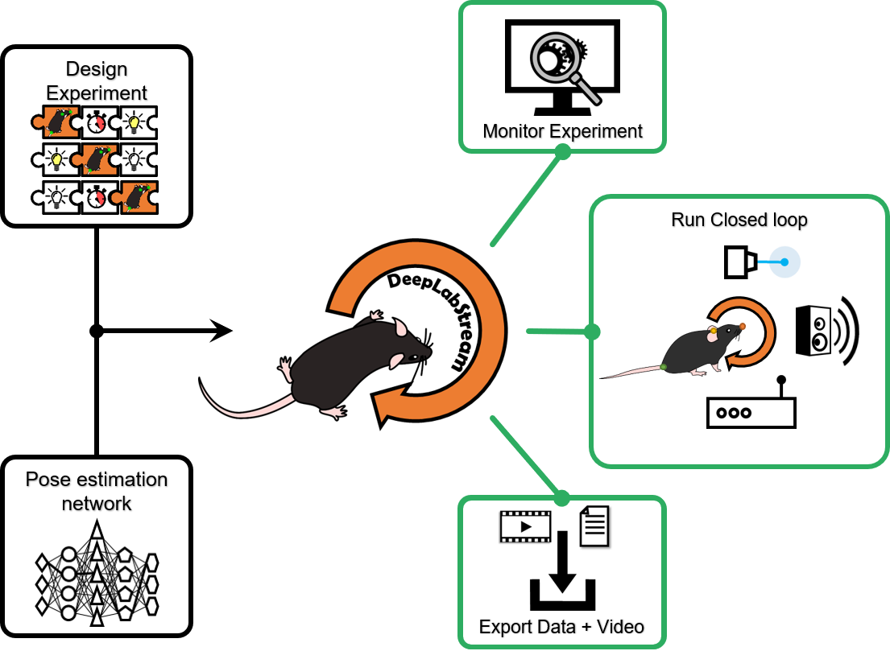
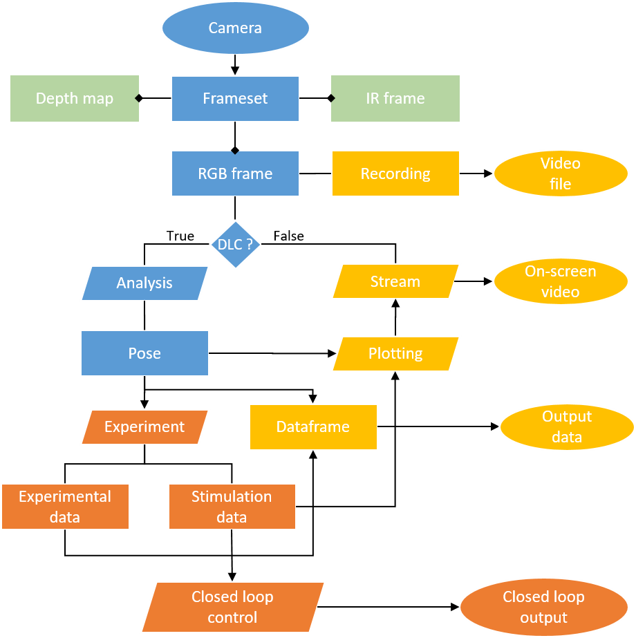
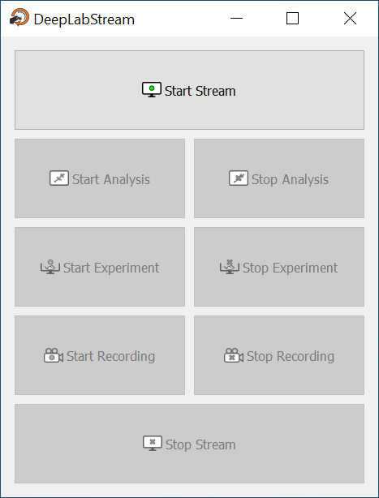
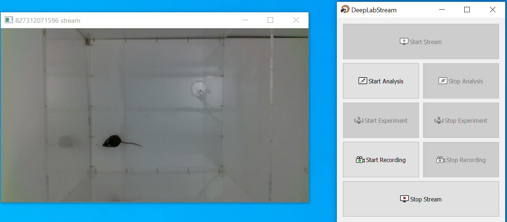
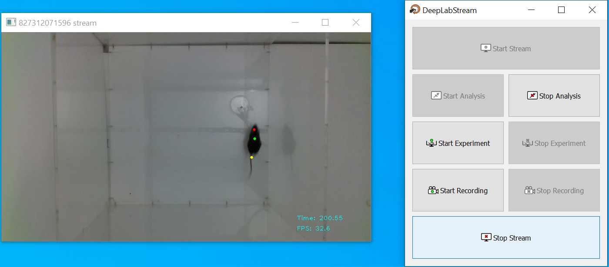
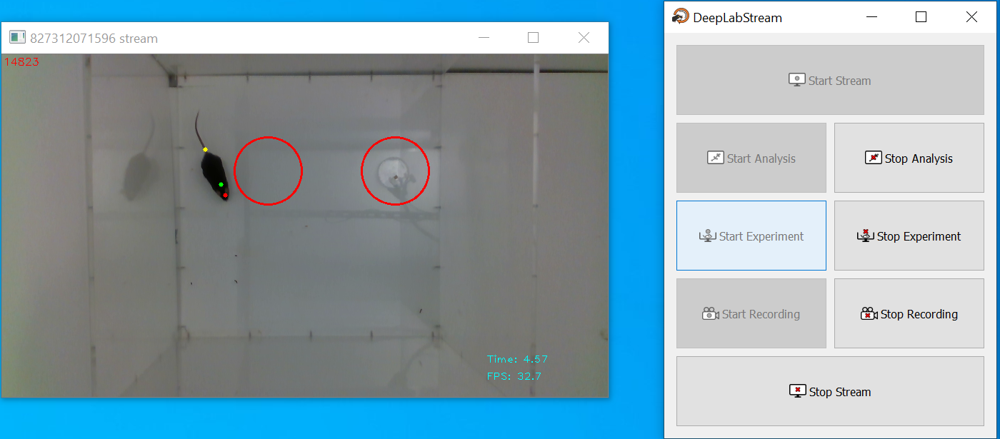
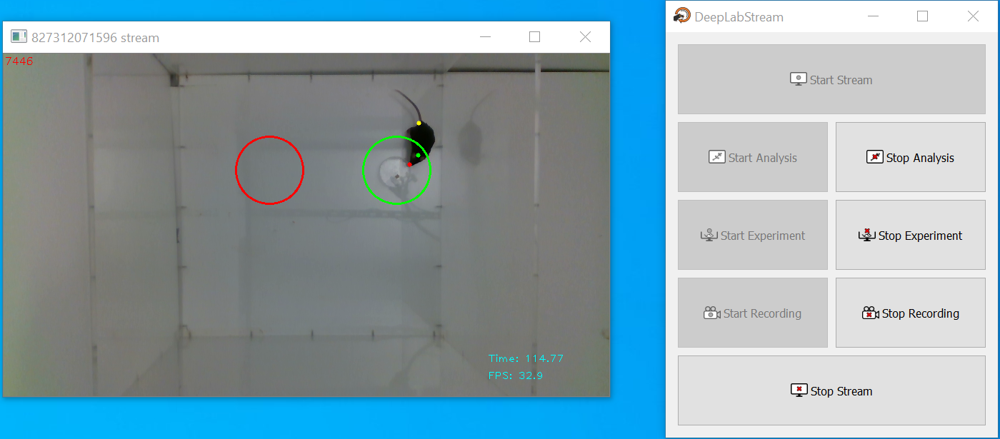

# DeepLabStream


DeepLabStream is a python based multi-purpose tool that enables the realtime tracking of animals and manipulation of experiments.
Our toolbox is adapted from the previously published [DeepLabCut](https://github.com/AlexEMG/DeepLabCut) ([Mathis et al., 2018](https://www.nature.com/articles/s41593-018-0209-y)] and expands on its core capabilities.
DeepLabStreams core feature is the real-time analysis using any type of camera-based video stream (incl. multiple streams).  Building onto that, we designed a full experimental closed-loop toolkit. It enables running experimental protocols that are dependent on a constant stream of bodypart positions and feedback activation of several input/output devices. It's capabilities range from simple region of interest (ROI) based triggers to headdirection or behavior dependent stimulation.

### Quick Reference:
 
 ### 1. [Installation](utils/Installation.md)

 
### How does this work

DeepLabStream uses the camera's video stream to simultaneously record a raw (read as unmodified) video of the ongoing experiment,
send frames one-by-one to the neuronal network for analysis, and use returned analysed data to plot and show a video stream for the experimenter to observe and control the experiment.
Analysed data will also be utilized to enable closed-loop experiments without any human interference, using triggers to operate equipment on predefined conditions
and to end, prolong or modify parts of experimental protocol.



## Installation

See [Installation](utils/Installation.md).

## Testing

To properly test your DeepLabStream installation, we included a testing script that you can run in three different modes. ```DeepLabStream.py``` allows you to test your cameras, your DeepLabcut installation,
and to benchmark your DeepLabStream performance.

1. Run the following command to test your cameras:
```bash
python DeepLabStream.py
```

2. Next, you can test how your DeepLabCut installation behaves and if you did correctly set the DeepLabCut path in the config:
```bash
python DeepLabStream.py --dlc-enabled
```

3. And finally you can benchmark your system automatically:
```bash
python DeepLabStream.py --dlc-enabled --benchmark-enabled
```
The stream would run until it gets 3000 analyzed frames (you can always stop it manually at any point, just press 'Q' while the stream window is in focus). 
Then it will show you a detailed statistic of the overall performance timings, analysis timings, percentage of frames where it did lose tracking and your average FPS.
 
#### Recording testing

Additionally, you can test and see the results of the build-in video recorder. Run the following command to test it:
```bash
python DeepLabStream.py --recording-enabled
```

This will record the videofeed from the camera to your `OUTPUT_DIRECTORY`. You can also add this flag to any of the previously mentioned tests to check performance with recording enabled.

Important note: **recording will always save only "raw" video, without analysis, with framerate as close to specified as possible**


## Usage

### How to use DeepLabStream

Just run 
```
cd DeepLabStream
python app.py
``` 

You will see the main control panel of a GUI app.



To start working with DeepLabStream, press the `Start Stream` button. It will activate the camera manager and show you the current view from the connected cameras.



After that you can `Start Analysis` to start DeepLabCut and receive a pose estimations for each frame, or, additionally, you can `Start Recording` to record a
video of the current feed (visible in the stream window). You will see your current video timestamp (counted in frames) and FPS after you pressed the `Start Analysis` button.



As you can see, we track three points that represent three body parts of the mouse - nose, neck and tail root.
Every single frame where the animal was tracked is outputted to the dataframe, which would create a .csv file after the analysis is finished.

After you finish with tracking and/or recording the video, you can stop either function by specifically pressing on corresponding "stop" button
(so, `Stop Analysis` or `Stop Recording`) or you can stop the app and refresh all the timing at once, by pressing `Stop Streaming` button.

#### Experiments

DeepLabStream was build specifically for closed-loop experiments, so with a properly implemented experiment protocol, running experiments on this system is as easy as 
pressing the `Start Experiment` button. Depending on your protocol and experimental goals, experiments could run and finish without any further engagement from the user.



In the provided `ExampleExperiment` two regions of interest (ROIs) are created inside an arena. The experiment is designed to count the number of times the mouse enters a ROI and trigger a corresponding visual stimulus on a screen.
The high contrast stimuli (image files) are located within the `experiments/src` folder and specified within the `experiments.py` `ExampleExperiments` Class.



As a visual representation of this event, the border of the ROI will turn green.

All experimental output will be stored to a .csv file for easy postprocessing.

### Known issues

#### Error when stopping the analysis:
```
BrokenPipeError: [Errno 32] Broken pipe
```

This is an `multiprocessing.Queue` closing error, when some items are still in the Queue.
This should not affect the app in any meaningful way.

#### Tensorflow not releasing GPU memory
Sometimes Tensorflow session will not release all allocated GPU memory when you stop the analysis. This will result in OOM (out of memory) error.
See more on that issue on [tensorflow github](https://github.com/tensorflow/tensorflow/issues/19731)

The error itself looks like this:
```
2020-02-10 13:44:49.972600: E tensorflow/stream_executor/cuda/cuda_driver.cc:806] failed to allocate 635,29M (666146048 bytes) from device: CUDA_ERROR_OUT_OF_MEMORY: out of memory
```

The issue can be resolved by closing and opening the app. If not, manually kill all python processes
```
killall -9 python
```

## License

## Authors
Lead Researcher: Jens Schweihoff, jens.schweihoff@ukbonn.de

Lead Developer: Matvey Loshakov, matveyloshakov@gmail.com
