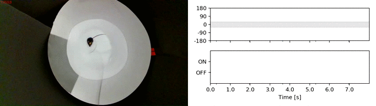

# DeepLabStream


[](https://github.com/SchwarzNeuroconLab/DeepLabStream)
[](https://github.com/SchwarzNeuroconLab/DeepLabStream)
[](https://www.gnu.org/licenses/gpl-3.0)
[](https://twitter.com/SNeuroconnect)

DeepLabStream is a python based multi-purpose tool that enables the realtime tracking and manipulation of animals during ongoing experiments.
Our toolbox was orginally adapted from the previously published [DeepLabCut](https://github.com/AlexEMG/DeepLabCut) ([Mathis et al., 2018](https://www.nature.com/articles/s41593-018-0209-y)) and expanded on its core capabilities, but is now able to utilize a variety of different network architectures for online pose estimation
 ([SLEAP](https://github.com/murthylab/sleap), [DLC-Live](https://github.com/DeepLabCut/DeepLabCut-live), [DeepPosekit's](https://github.com/jgraving/DeepPoseKit) StackedDenseNet, StackedHourGlass and [LEAP](https://github.com/murthylab/sleap)).

DeepLabStreams core feature is the utilization of real-time tracking to orchestrate closed-loop experiments. This can be achieved using any type of camera-based video stream (incl. multiple streams).  It enables running experimental protocols that are dependent on a constant stream of bodypart positions and feedback activation of several input/output devices. It's capabilities range from simple region of interest (ROI) based triggers to headdirection or behavior dependent stimulation.



## New features:

#### 02/2021: Multiple Animal Experiments: Full [SLEAP](https://github.com/murthylab/sleap) integration (Tutorials & models coming soon!)

#### 01/2021: DLStream was published in [Communications Biology](https://www.nature.com/articles/s42003-021-01654-9)

#### 12/2021: New pose estimation model integration ([DLC-Live](https://github.com/DeepLabCut/DeepLabCut-live)) and pre-release of further integration ([DeepPosekit's](https://github.com/jgraving/DeepPoseKit) StackedDenseNet, StackedHourGlass and [LEAP](https://github.com/murthylab/sleap))

## Quick Reference:

 #### Check out or wiki: [DLStream Wiki](https://github.com/SchwarzNeuroconLab/DeepLabStream/wiki)

 #### Read the paper: [Schweihoff, et al. 2021](https://www.nature.com/articles/s42003-021-01654-9)
 
 #### Contributing

If you have feature requests or questions regarding the design of experiments join our [slack group](https://join.slack.com/t/dlstream/shared_invite/zt-jpy2olk1-CuJu0ZylGg_SLbO7zBkcrg)!

We are constantly working to update and increase the capabilities of DLStream. 
We welcome all feedback and input from your side.

 
 ### 1. [Updated Installation & Testing](https://github.com/SchwarzNeuroconLab/DeepLabStream/wiki/Installation-&-Testing)
 
 ### 2. [How to use DLStream GUI](https://github.com/SchwarzNeuroconLab/DeepLabStream/wiki/How-to-use-DLStream)
 
 ### 3. Check out our [Out-of-the-Box](https://github.com/SchwarzNeuroconLab/DeepLabStream/wiki/Out-Of-The-Box:-Overview) 
 
 ### 4. [Design an Out-of-the-Box Experiment](https://github.com/SchwarzNeuroconLab/DeepLabStream/wiki/Out-Of-The-Box:-Design-Experiments)
 
### What's underneath?:
 
 ### 5. [Introduction to experiments](https://github.com/SchwarzNeuroconLab/DeepLabStream/wiki/Introduction)
 
 ### For advanced users:
 
 ### 6. [Design your first experiment](https://github.com/SchwarzNeuroconLab/DeepLabStream/wiki/My-first-experiment)
 
 ### 7. [Adapting an existing experiment to your own needs](https://github.com/SchwarzNeuroconLab/DeepLabStream/wiki/Adapting-an-existing-experiment-to-your-own-needs)
 


### How to use DeepLabStream

Just run 
```
cd DeepLabStream
python app.py
``` 

You will see the main control panel of a GUI app.


To start working with DeepLabStream, press the `Start Stream` button. It will activate the camera manager and show you the current view from the connected cameras.


After that you can `Start Analysis` to start DeepLabCut and receive a pose estimations for each frame, or, additionally, you can `Start Recording` to record a
video of the current feed (visible in the stream window). You will see your current video timestamp (counted in frames) and FPS after you pressed the `Start Analysis` button.


As you can see, we track three points that represent three body parts of the mouse - nose, neck and tail root.
Every single frame where the animal was tracked is outputted to the dataframe, which would create a .csv file after the analysis is finished.

After you finish with tracking and/or recording the video, you can stop either function by specifically pressing on corresponding "stop" button
(so, `Stop Analysis` or `Stop Recording`) or you can stop the app and refresh all the timing at once, by pressing `Stop Streaming` button.

#### Experiments

DeepLabStream was build specifically for closed-loop experiments, so with a properly implemented experiment protocol, running experiments on this system is as easy as 
pressing the `Start Experiment` button. Depending on your protocol and experimental goals, experiments could run and finish without any further engagement from the user.


In the provided `ExampleExperiment` two regions of interest (ROIs) are created inside an arena. The experiment is designed to count the number of times the mouse enters a ROI and trigger a corresponding visual stimulus on a screen.
The high contrast stimuli (image files) are located within the `experiments/src` folder and specified within the `experiments.py` `ExampleExperiments` Class.


As a visual representation of this event, the border of the ROI will turn green.

All experimental output will be stored to a .csv file for easy postprocessing. Check out [Working with DLStream output](https://github.com/SchwarzNeuroconLab/DeepLabStream/wiki/Working-with-DLStream-output) for further details.

Look at the [Introduction to experiments](https://github.com/SchwarzNeuroconLab/DeepLabStream/wiki/Introduction) to get an idea how to design your own experiment in DeepLabStream or learn how to adapt one of the already published experiments at [Adapting an existing experiment](https://github.com/SchwarzNeuroconLab/DeepLabStream/wiki/Adapting-an-existing-experiment-to-your-own-needs).

## How does this work

DeepLabStream uses the camera's video stream to simultaneously record a raw (read as unmodified) video of the ongoing experiment,
send frames one-by-one to the neuronal network for analysis, and use returned analysed data to plot and show a video stream for the experimenter to observe and control the experiment.
Analysed data will also be utilized to enable closed-loop experiments without any human interference, using triggers to operate equipment on predefined conditions
and to end, prolong or modify parts of experimental protocol.


### Known issues

If you encounter any issues or errors, you can check out the wiki article ([Help there is an error!](https://github.com/SchwarzNeuroconLab/DeepLabStream/wiki/Help-there-is-an-error!)). If your issue is not listed yet, please refer to the issues and either submit a new issue or find a reported issue (which might be already solved) there. Thank you!

## References:

If you use this code or data please cite:


Schweihoff, J.F., Loshakov, M., Pavlova, I. et al. DeepLabStream enables closed-loop behavioral experiments using deep learning-based markerless, real-time posture detection. 

Commun Biol 4, 130 (2021). https://doi.org/10.1038/s42003-021-01654-9

## License
This project is licensed under the GNU General Public License v3.0. Note that the software is provided "as is", without warranty of any kind, expressed or implied. 

## Authors

Developed by:
- Jens Schweihoff, jens.schweihoff@ukbonn.de

- Matvey Loshakov, matveyloshakov@gmail.com

Corresponding Author: Martin Schwarz, Martin.Schwarz@ukbonn.de
